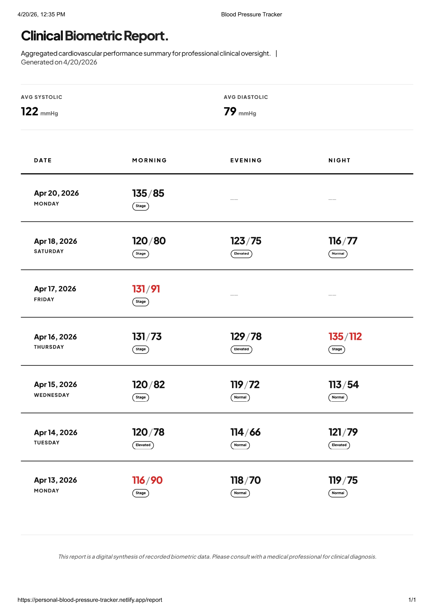

# Personal Blood Pressure Tracker

A modern, clinical-grade cardiovascular performance dashboard designed for individual use. This application allows users to monitor real-time blood pressure data and clinical trends across a secure cloud ledger.

**Live Demo**: [https://personal-blood-pressure-tracker.netlify.app/](https://personal-blood-pressure-tracker.netlify.app/)

## Overview

The Personal Blood Pressure Tracker is built with professional aesthetics, focusing on a minimalist, high-contrast, black-and-white theme. It provides high-fidelity biometric metric visualization (systolic/diastolic) while maintaining a clean and professional reporting layout.

## Key Features

* **Biometric Dashboard**: A single-page, auto-responsive dashboard that visualizes cardiovascular data without the need to scroll on standard viewports.
* **Clinical Health Trends**: Advanced area charts rendering daily average blood pressure metrics.
* **Data Logging**: Simplified, precise data entry via a seamless form interface for daily records.
* **Historical Journal**: A chronological archive detailing morning, evening, and night stage readings.
* **Professional Reporting**: A printable, clinical-style report page optimized for exporting.
* **Cloud Persistence**: Robust integration with Firebase Firestore for real-time synchronization and secure history storage.

## Screenshots

### Main Dashboard
.png)

### Dashboard - Recent Activity
.png)

### Log Reading Interface
.png)

### Clinical Report


## Technology Stack

* **Frontend Framework**: React 18
* **Routing**: React Router DOM
* **Styling**: Tailwind CSS (with advanced flex layouts and modern typography)
* **Data Visualization**: Recharts
* **Icons**: Lucide React
* **Backend Storage**: Firebase / Cloud Firestore
* **Deployment Infrastructure**: Global CI/CD Integration (Netlify / Vercel / GitHub Actions)

## Installation and Setup

1. Clone the repository:
   ```bash
   git clone https://github.com/adeshasur/Personal-Blood-Pressure-Tracker.git
   ```

2. Navigate to the project directory:
   ```bash
   cd Personal-Blood-Pressure-Tracker
   ```

3. Install dependencies:
   ```bash
   npm install
   ```

4. Configure Environment Variables:
   Create a `.env` file referencing your Firebase configuration securely.

5. Start the development server:
   ```bash
   npm start
   ```

6. Build for production:
   ```bash
   npm run build
   ```

## Architecture Notes

The project executes a highly specialized layout using strict CSS Flexbox rules (`h-screen`, `flex-1`, `min-h-0`) to mathematically evaluate viewport parameters, projecting an application-first experience that fully abolishes vertical browser scrolling. It implements production-ready lint validations (ESLint strict mode compatibilities for CI chains) to guarantee secure, high-uptime stability.
